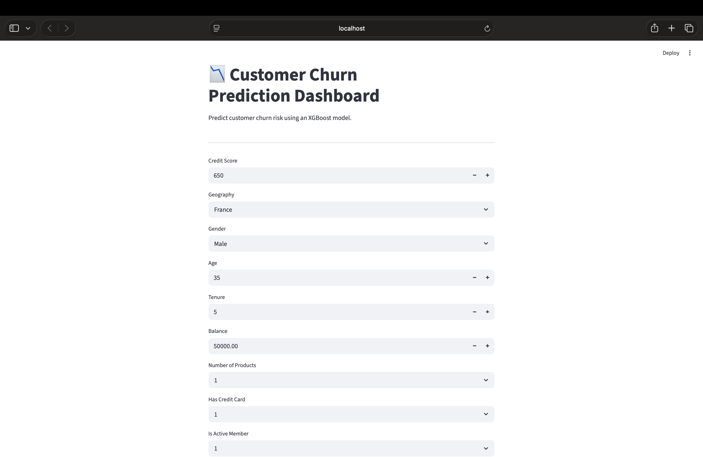
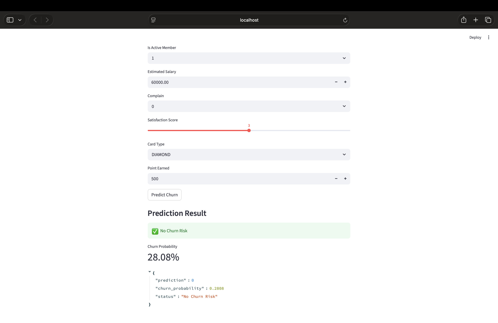
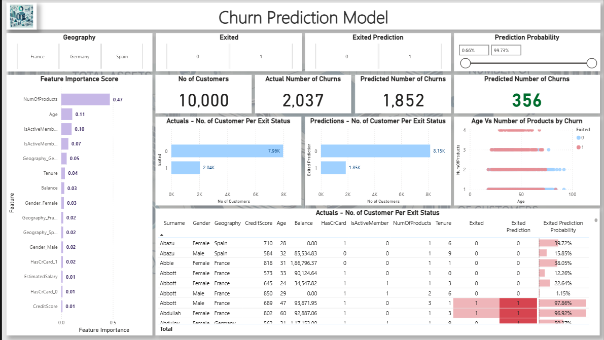

# 📉 Customer Churn Prediction Dashboard

This project predicts customer churn using a machine learning model and presents the results through an interactive Streamlit application and a Power BI dashboard. The goal is to identify customers who are likely to leave and provide business insights that can support customer retention strategies.

The project uses customer demographic, account, and banking-related features to train an XGBoost classification model. The workflow includes data preprocessing, feature encoding, scaling, class balancing, model training, evaluation, and real-time prediction through a user-friendly dashboard.

## 🚀 Project Highlights

- Built a customer churn prediction model using XGBoost
- Applied preprocessing, feature encoding, scaling, and class balancing
- Created an interactive Streamlit app for real-time churn prediction
- Developed a Power BI dashboard for business-level churn analysis
- Saved trained model artifacts for reusable prediction workflow
- Organized the project into a clean production-style folder structure

## 🧠 Machine Learning Workflow

Raw Customer Data → Data Cleaning → Feature Encoding → Scaling → Model Training → Evaluation → Streamlit Prediction App → Power BI Business Dashboard

## 📊 Demo Outputs

### Streamlit Prediction Output 1

### Streamlit Prediction Output 2

### Power BI Dashboard

## 🛠️ Tech Stack

- Python
- Pandas
- NumPy
- Scikit-learn
- XGBoost
- SMOTE
- Streamlit
- Power BI
- Joblib
- Matplotlib / Plotly

## ⚙️ How to Run

1. Create and activate a virtual environment:
2. Install dependencies:
3. Run preprocessing:
4. Train the model:
5. Evaluate the model:
6. Run the Streamlit app:

## 📊 Power BI Dashboard

The Power BI dashboard provides a business view of churn patterns, customer segments, and important churn-related features. It helps translate model results into actionable business insights for retention strategy.

## 💡 Business Value

This project demonstrates how machine learning can support customer retention by identifying high-risk customers early. The combination of predictive modeling, Streamlit-based real-time prediction, and Power BI reporting makes the project useful for both technical and business stakeholders.   
